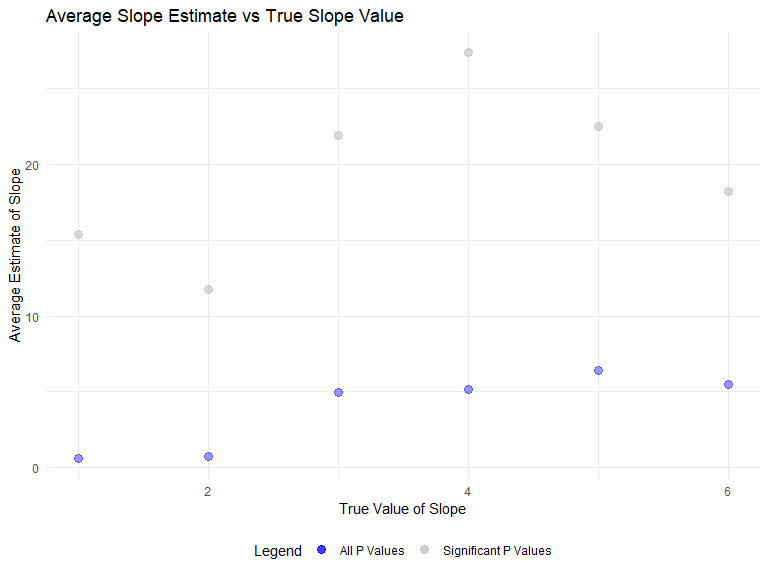

Homework 5
================
Julia Thompson
11/5/2019

## Problem 1

``` r
set.seed(10)

iris_with_missing = iris %>% 
  map_df(~replace(.x, sample(1:150, 20), NA)) %>%
  mutate(Species = as.character(Species))
```

There are two cases to address:

For numeric variables, you should fill in missing values with the mean
of non-missing values For character variables, you should fill in
missing values with “virginica” Write a function that takes a vector as
an argument; replaces missing values using the rules defined above; and
returns the resulting
vector.

``` r
# Want a function that takes in 1 vector and outputs another vector with missing values replaced

replace_missing_fn = function(vector) {
  
  if(length(vector) == 1){
    stop("Argument cannot be computed for length 1 vectors")
  }
  
  else if(is.numeric(vector)) {
    mean = mean(vector, na.rm=TRUE)
    tibble(
      replace_na(vector, mean)
    )
  }
  
  else if (!is.numeric(vector)) {
    tibble(
      replace_na(vector, "virginica")
    )
  }
}
```

Apply this function to the columns of iris\_with\_missing using a map
statement.

``` r
output = map(iris_with_missing, replace_missing_fn) %>% 
  bind_cols()
```

## Problem 2

Start with a dataframe containing all file names; the list.files
function will help

Iterate over file names and read in data for each subject using
purrr::map and saving the result as a new variable in the dataframe

Tidy the result; manipulate file names to include control arm and
subject ID, make sure weekly observations are “tidy”, and do any other
tidying that’s necessary

``` r
files = tibble(csv_name = list.files("./data/")) %>% 
  mutate(
    input = str_c("./data/", csv_name)
  ) %>% 
  separate(csv_name, into = c("arm", "subject_id", "csv"), sep = "([\\_\\.])") %>% 
  select(-csv) %>% 
  mutate(
  data = map(input, read_csv)
  ) %>% 
  unnest(data) %>% 
  select(-input) %>% 
  pivot_longer(
    cols = week_1:week_8,
    names_to = "week",
    names_prefix = "week_",
    values_to = "value"
  ) 
```

Make a spaghetti plot showing observations on each subject over time,
and comment on differences between groups.

``` r
control = files %>% 
  filter(arm == "con")

experimental = files %>% 
  filter(arm == "exp")

spaghetti_combined = 
  ggplot(control, aes(x = week, y = value, group = subject_id)) +
  geom_line(aes(color = "Control")) +
  geom_line(data = experimental, aes(x = week, y = value, color = "Experimental"))+
  scale_color_manual("Legend", values = c("black", "orange"))+
  labs(
    title = "Observation on Each Subject Over Time in Control and Experimental Groups",
    x = "Week",
    y = "Value"
  )
```

## Problem 3

Set β1=0. Generate 10000 datasets from the model. For each dataset, save
β^1 and the p-value arising from a test of H:β1=0 using α=0.05.

``` r
set.seed(5)

sim_regression = function(beta1) {
  
  sim_data = tibble(
    x = rnorm(30, mean = 0, sd = 1),
    y = 2 + beta1 * x + rnorm(30, 0, sqrt(50))
  )
  
  ls_fit = lm(y ~ x, data = sim_data) %>% 
    broom::tidy() %>% 
    filter(term == "x") %>% 
    select(estimate, p.value)
  
  ls_fit
}

# Generate 10k datasets, saving the estimate and p value when beta1 = 0 to 6
sim_results = 
  tibble(beta1_values = c(0, 1, 2, 3, 4, 5, 6)) %>% 
  mutate(
    output_list = map(.x = beta1_values, ~ rerun(1000, sim_regression(beta1 = .x))),
    output_df = map(output_list, bind_rows)
  ) %>% 
  select(-output_list) %>% 
  unnest(output_df)
```

Make a plot showing the proportion of times the null was rejected (the
power of the test) on the y axis and the true value of β1 on the x axis.
Describe the association between effect size and power.

``` r
prop_rej = sim_results %>% 
  mutate(
    reject = as.numeric(p.value < 0.05)
  ) %>% 
  group_by(beta1_values) %>% 
  summarize(
    prop = sum(reject)/n()
  )

ggplot(prop_rej, aes(x = beta1_values, y = prop)) +
  geom_point(size = 3, alpha = .4) +
  labs(
    title = "Power vs Effect Size",
    x = "Effect Size",
    y = "Power",
    caption = "Observing the relationship between power and effect size using simulations"
  )
```


Make a plot showing the average estimate of β^1 on the y axis and the
true value of β1 on the x axis. Make a second plot (or overlay on the
first) the average estimate of β^1 only in samples for which the null
was rejected on the y axis and the true value of β1 on the x axis. Is
the sample average of β^1 across tests for which the null is rejected
approximately equal to the true value of β1? Why or why not?

``` r
b1_vs_truth = sim_results %>% 
  mutate(
    reject = as.numeric(p.value < 0.05)
  ) %>% 
  group_by(beta1_values) %>% 
  summarize(
    avg_b1 = mean(estimate)
  )

b1_vs_truth_rejected = sim_results %>% 
  mutate(
    reject = as.numeric(p.value < 0.05)
  ) %>% 
  filter(reject == 1) %>% 
  group_by(beta1_values) %>% 
  summarize(
    avg_b1 = mean(estimate)
  )

plot_b1_vs_truth = ggplot(b1_vs_truth, aes(x = beta1_values, y = avg_b1)) +
  geom_point(aes(color = "All P Values"), size = 3, alpha = .4) +
  geom_point(data = b1_vs_truth_rejected, aes(color = "Significant P Values"), size = 3, alpha = .6) +
  scale_color_manual("Legend", values = c("blue", "grey")) +
  labs(
    title = "Average Slope Estimate vs True Slope Value",
    x = "True Slope Value",
    y = "Average Slope Estimate",
    caption = "Comparing average slope estimate and true slope value for all p values and for only significant p values"
  )

plot_b1_vs_truth
```


