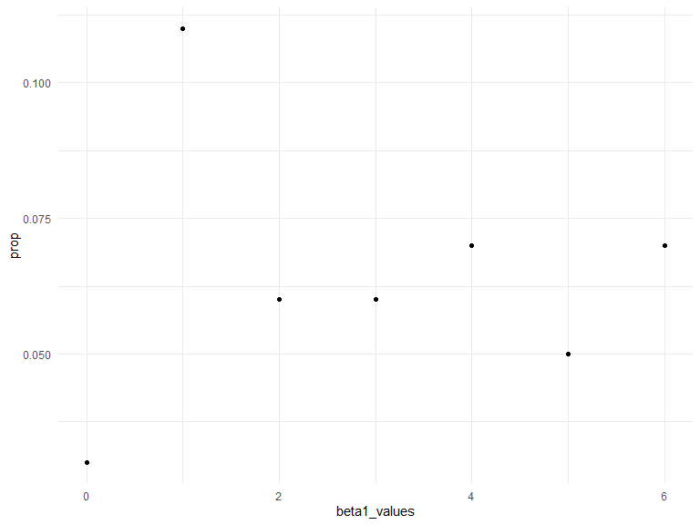

Homework 5
================
Julia Thompson
11/5/2019

## Problem 1

``` r
set.seed(10)

iris_with_missing = iris %>% 
  map_df(~replace(.x, sample(1:150, 20), NA)) %>%
  mutate(Species = as.character(Species))
```

There are two cases to address:

For numeric variables, you should fill in missing values with the mean
of non-missing values For character variables, you should fill in
missing values with “virginica” Write a function that takes a vector as
an argument; replaces missing values using the rules defined above; and
returns the resulting vector.

``` r
mean_sepal = mean(pull(iris_with_missing, Sepal.Length), na.rm=TRUE)

test_replace = tibble(replace_na(pull(iris_with_missing, Sepal.Length), mean_sepal))

rest2_replace = tibble(replace_na(pull(iris_with_missing, Species), "virginica"))
```

``` r
# Want a function that takes in 1 vector and outputs another vector with missing values replaced

replace_missing_fn = function(vector) {
  
  if(length(vector) == 1){
    stop("Argument cannot be computed for length 1 vectors")
  }
  
  else if(is.numeric(vector)) {
    mean = mean(vector, na.rm=TRUE)
    tibble(
      replace_na(vector, mean)
    )
  }
  
  else if (!is.numeric(vector)) {
    tibble(
      replace_na(vector, "virginica")
    )
  }
}

# Test the function

replace_missing_fn(pull(iris_with_missing, Sepal.Length))
```

    ## # A tibble: 150 x 1
    ##    `replace_na(vector, mean)`
    ##                         <dbl>
    ##  1                       5.1 
    ##  2                       4.9 
    ##  3                       4.7 
    ##  4                       4.6 
    ##  5                       5   
    ##  6                       5.4 
    ##  7                       5.82
    ##  8                       5   
    ##  9                       4.4 
    ## 10                       4.9 
    ## # ... with 140 more rows

``` r
# replace_missing_fn(2)

replace_missing_fn(pull(iris_with_missing, Species))
```

    ## # A tibble: 150 x 1
    ##    `replace_na(vector, "virginica")`
    ##    <chr>                            
    ##  1 setosa                           
    ##  2 setosa                           
    ##  3 setosa                           
    ##  4 setosa                           
    ##  5 setosa                           
    ##  6 setosa                           
    ##  7 setosa                           
    ##  8 setosa                           
    ##  9 setosa                           
    ## 10 setosa                           
    ## # ... with 140 more rows

Apply this function to the columns of iris\_with\_missing using a map
statement.

``` r
output = map(iris_with_missing, replace_missing_fn) %>% 
  bind_cols()
```

## Problem 2

Start with a dataframe containing all file names; the list.files
function will help

Iterate over file names and read in data for each subject using
purrr::map and saving the result as a new variable in the dataframe

Tidy the result; manipulate file names to include control arm and
subject ID, make sure weekly observations are “tidy”, and do any other
tidying that’s necessary

``` r
files = tibble(csv_name = list.files("./data/")) %>% 
  mutate(
    input = str_c("./data/", csv_name)
  ) %>% 
  separate(csv_name, into = c("arm", "subject_id", "csv"), sep = "([\\_\\.])") %>% 
  select(-csv) %>% 
  mutate(
  data = map(input, read_csv)
  ) %>% 
  unnest(data) %>% 
  select(-input)
```

    ## Parsed with column specification:
    ## cols(
    ##   week_1 = col_double(),
    ##   week_2 = col_double(),
    ##   week_3 = col_double(),
    ##   week_4 = col_double(),
    ##   week_5 = col_double(),
    ##   week_6 = col_double(),
    ##   week_7 = col_double(),
    ##   week_8 = col_double()
    ## )
    ## Parsed with column specification:
    ## cols(
    ##   week_1 = col_double(),
    ##   week_2 = col_double(),
    ##   week_3 = col_double(),
    ##   week_4 = col_double(),
    ##   week_5 = col_double(),
    ##   week_6 = col_double(),
    ##   week_7 = col_double(),
    ##   week_8 = col_double()
    ## )
    ## Parsed with column specification:
    ## cols(
    ##   week_1 = col_double(),
    ##   week_2 = col_double(),
    ##   week_3 = col_double(),
    ##   week_4 = col_double(),
    ##   week_5 = col_double(),
    ##   week_6 = col_double(),
    ##   week_7 = col_double(),
    ##   week_8 = col_double()
    ## )
    ## Parsed with column specification:
    ## cols(
    ##   week_1 = col_double(),
    ##   week_2 = col_double(),
    ##   week_3 = col_double(),
    ##   week_4 = col_double(),
    ##   week_5 = col_double(),
    ##   week_6 = col_double(),
    ##   week_7 = col_double(),
    ##   week_8 = col_double()
    ## )
    ## Parsed with column specification:
    ## cols(
    ##   week_1 = col_double(),
    ##   week_2 = col_double(),
    ##   week_3 = col_double(),
    ##   week_4 = col_double(),
    ##   week_5 = col_double(),
    ##   week_6 = col_double(),
    ##   week_7 = col_double(),
    ##   week_8 = col_double()
    ## )
    ## Parsed with column specification:
    ## cols(
    ##   week_1 = col_double(),
    ##   week_2 = col_double(),
    ##   week_3 = col_double(),
    ##   week_4 = col_double(),
    ##   week_5 = col_double(),
    ##   week_6 = col_double(),
    ##   week_7 = col_double(),
    ##   week_8 = col_double()
    ## )
    ## Parsed with column specification:
    ## cols(
    ##   week_1 = col_double(),
    ##   week_2 = col_double(),
    ##   week_3 = col_double(),
    ##   week_4 = col_double(),
    ##   week_5 = col_double(),
    ##   week_6 = col_double(),
    ##   week_7 = col_double(),
    ##   week_8 = col_double()
    ## )
    ## Parsed with column specification:
    ## cols(
    ##   week_1 = col_double(),
    ##   week_2 = col_double(),
    ##   week_3 = col_double(),
    ##   week_4 = col_double(),
    ##   week_5 = col_double(),
    ##   week_6 = col_double(),
    ##   week_7 = col_double(),
    ##   week_8 = col_double()
    ## )
    ## Parsed with column specification:
    ## cols(
    ##   week_1 = col_double(),
    ##   week_2 = col_double(),
    ##   week_3 = col_double(),
    ##   week_4 = col_double(),
    ##   week_5 = col_double(),
    ##   week_6 = col_double(),
    ##   week_7 = col_double(),
    ##   week_8 = col_double()
    ## )
    ## Parsed with column specification:
    ## cols(
    ##   week_1 = col_double(),
    ##   week_2 = col_double(),
    ##   week_3 = col_double(),
    ##   week_4 = col_double(),
    ##   week_5 = col_double(),
    ##   week_6 = col_double(),
    ##   week_7 = col_double(),
    ##   week_8 = col_double()
    ## )
    ## Parsed with column specification:
    ## cols(
    ##   week_1 = col_double(),
    ##   week_2 = col_double(),
    ##   week_3 = col_double(),
    ##   week_4 = col_double(),
    ##   week_5 = col_double(),
    ##   week_6 = col_double(),
    ##   week_7 = col_double(),
    ##   week_8 = col_double()
    ## )
    ## Parsed with column specification:
    ## cols(
    ##   week_1 = col_double(),
    ##   week_2 = col_double(),
    ##   week_3 = col_double(),
    ##   week_4 = col_double(),
    ##   week_5 = col_double(),
    ##   week_6 = col_double(),
    ##   week_7 = col_double(),
    ##   week_8 = col_double()
    ## )
    ## Parsed with column specification:
    ## cols(
    ##   week_1 = col_double(),
    ##   week_2 = col_double(),
    ##   week_3 = col_double(),
    ##   week_4 = col_double(),
    ##   week_5 = col_double(),
    ##   week_6 = col_double(),
    ##   week_7 = col_double(),
    ##   week_8 = col_double()
    ## )
    ## Parsed with column specification:
    ## cols(
    ##   week_1 = col_double(),
    ##   week_2 = col_double(),
    ##   week_3 = col_double(),
    ##   week_4 = col_double(),
    ##   week_5 = col_double(),
    ##   week_6 = col_double(),
    ##   week_7 = col_double(),
    ##   week_8 = col_double()
    ## )
    ## Parsed with column specification:
    ## cols(
    ##   week_1 = col_double(),
    ##   week_2 = col_double(),
    ##   week_3 = col_double(),
    ##   week_4 = col_double(),
    ##   week_5 = col_double(),
    ##   week_6 = col_double(),
    ##   week_7 = col_double(),
    ##   week_8 = col_double()
    ## )
    ## Parsed with column specification:
    ## cols(
    ##   week_1 = col_double(),
    ##   week_2 = col_double(),
    ##   week_3 = col_double(),
    ##   week_4 = col_double(),
    ##   week_5 = col_double(),
    ##   week_6 = col_double(),
    ##   week_7 = col_double(),
    ##   week_8 = col_double()
    ## )
    ## Parsed with column specification:
    ## cols(
    ##   week_1 = col_double(),
    ##   week_2 = col_double(),
    ##   week_3 = col_double(),
    ##   week_4 = col_double(),
    ##   week_5 = col_double(),
    ##   week_6 = col_double(),
    ##   week_7 = col_double(),
    ##   week_8 = col_double()
    ## )
    ## Parsed with column specification:
    ## cols(
    ##   week_1 = col_double(),
    ##   week_2 = col_double(),
    ##   week_3 = col_double(),
    ##   week_4 = col_double(),
    ##   week_5 = col_double(),
    ##   week_6 = col_double(),
    ##   week_7 = col_double(),
    ##   week_8 = col_double()
    ## )
    ## Parsed with column specification:
    ## cols(
    ##   week_1 = col_double(),
    ##   week_2 = col_double(),
    ##   week_3 = col_double(),
    ##   week_4 = col_double(),
    ##   week_5 = col_double(),
    ##   week_6 = col_double(),
    ##   week_7 = col_double(),
    ##   week_8 = col_double()
    ## )
    ## Parsed with column specification:
    ## cols(
    ##   week_1 = col_double(),
    ##   week_2 = col_double(),
    ##   week_3 = col_double(),
    ##   week_4 = col_double(),
    ##   week_5 = col_double(),
    ##   week_6 = col_double(),
    ##   week_7 = col_double(),
    ##   week_8 = col_double()
    ## )

## Problem 3

``` r
set.seed(1)

sim_regression = function(beta1) {
  
  sim_data = tibble(
    x = rnorm(30, mean = 0, sd = 1),
    y = 2 + beta1 * x + rnorm(30, 0, 50)
  )
  
  ls_fit = lm(y ~ x, data = sim_data) %>% 
    broom::tidy() %>% 
    filter(term == "x") %>% 
    select(estimate, p.value)
  
  ls_fit
}

sim_results = 
  tibble(beta1_values = c(0, 1, 2, 3, 4, 5, 6)) %>% 
  mutate(
    output_list = map(.x = beta1_values, ~ rerun(100, sim_regression(beta1 = .x))),
    output_df = map(output_list, bind_rows)
  ) %>% 
  select(-output_list) %>% 
  unnest(output_df)
```

Make a plot showing the proportion of times the null was rejected (the
power of the test) on the y axis and the true value of β1 on the x axis.
Describe the association between effect size and power.

``` r
prop_rej = sim_results %>% 
  mutate(
    reject = as.numeric(p.value < 0.05)
  ) %>% 
  group_by(beta1_values) %>% 
  summarize(
    prop = sum(reject)/n()
  )

ggplot(prop_rej, aes(x = beta1_values, y = prop)) +
  geom_point()
```



Make a plot showing the average estimate of β^1 on the y axis and the
true value of β1 on the x axis. Make a second plot (or overlay on the
first) the average estimate of β^1 only in samples for which the null
was rejected on the y axis and the true value of β1 on the x axis. Is
the sample average of β^1 across tests for which the null is rejected
approximately equal to the true value of β1? Why or why not?

``` r
b1_vs_truth = sim_results %>% 
  mutate(
    reject = as.numeric(p.value < 0.05)
  ) %>% 
  group_by(beta1_values) %>% 
  summarize(
    avg_b1 = mean(estimate)
  )

b1_vs_truth_rejected = sim_results %>% 
  mutate(
    reject = as.numeric(p.value < 0.05)
  ) %>% 
  filter(reject == 1) %>% 
  group_by(beta1_values) %>% 
  summarize(
    avg_b1 = mean(estimate)
  )

plot_b1vstruth = ggplot(b1_vs_truth, aes(x = beta1_values, y = avg_b1)) +
  geom_point(color = "blue", size = 3, alpha = .3) +
  geom_point(data = b1_vs_truth_rejected, color = "grey", size = 3, alpha = 0.6)

#plot_b1vstruth_rej = ggplot(b1_vs_truth_rejected, aes(x = beta1_values, y = avg_b1)) +
#  geom_point()
```
