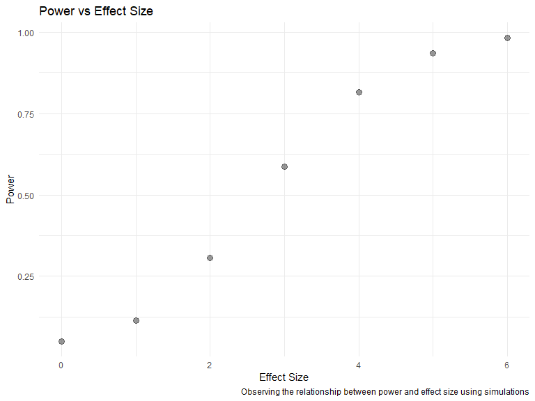
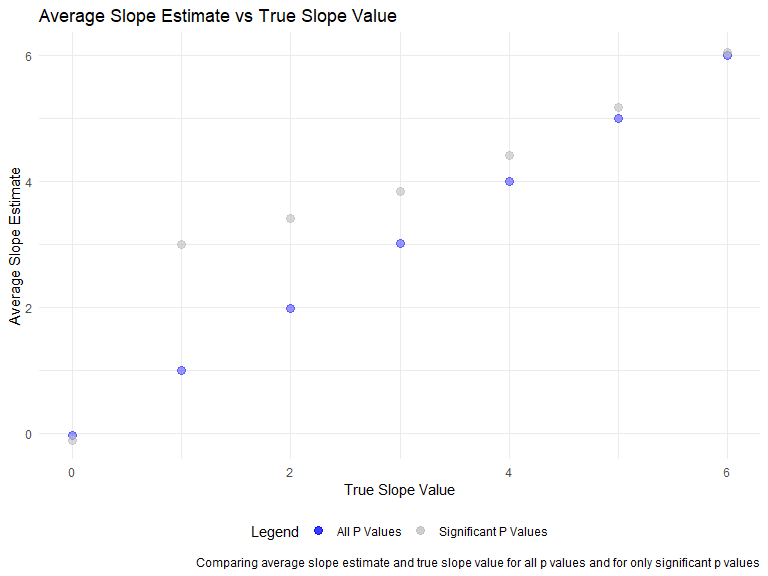

Homework 5
================
Julia Thompson
11/5/2019

## Problem 1

``` r
set.seed(10)

iris_with_missing = iris %>% 
  map_df(~replace(.x, sample(1:150, 20), NA)) %>%
  mutate(Species = as.character(Species))
```

The below function, *replace\_missing\_fn*, takes in a vector as an
argument and replaces missing values with the below rules, and returns
the new vector:

  - For numeric variables, fill in missing values with the mean of
    non-missing values

  - For character variables, fill in missing values with
“virginica”

<!-- end list -->

``` r
# Want a function that takes in 1 vector and outputs another vector with missing values replaced

replace_missing_fn = function(vector) {
  
  if(length(vector) == 1){
    stop("Argument cannot be computed for length 1 vectors")
  }
  
  else if(is.numeric(vector)) {
    mean = mean(vector, na.rm=TRUE)
    tibble(
      replace_na(vector, mean)
    )
  }
  
  else if (!is.numeric(vector)) {
    tibble(
      replace_na(vector, "virginica")
    )
  }
}
```

Now, we apply this function to the *iris\_with\_missing* dataset:

``` r
iris_without_missing = map(iris_with_missing, replace_missing_fn) %>% 
  bind_cols()
```

## Problem 2

The below function, *files*, reads in data for each subject and saves
the result as a new variable in the dataframe. It returns a tidy
dataframe with variables for arm (control or experimental), subject ID
(1 to 10), week (1 to 8), and data value.

``` r
files = tibble(csv_name = list.files("./data/")) %>% 
  mutate(
    input = str_c("./data/", csv_name)
  ) %>% 
  separate(csv_name, into = c("arm", "subject_id", "csv"), sep = "([\\_\\.])") %>% 
  select(-csv) %>% 
  mutate(
  data = map(input, read_csv)
  ) %>% 
  unnest(data) %>% 
  select(-input) %>% 
  pivot_longer(
    cols = week_1:week_8,
    names_to = "week",
    names_prefix = "week_",
    values_to = "value"
  ) 
```

Below is a spaghetti plot showing observations on each subject over time
within the control and experimental groups. At week 1, the control and
experimental groups had roughly similar observation values, but over the
weeks we see more separation between the two. By week 8, there is a
clear pattern of the experimental group having higher values than the
control group.

``` r
control = files %>% 
  filter(arm == "con")

experimental = files %>% 
  filter(arm == "exp")

spaghetti_combined = 
  ggplot(control, aes(x = week, y = value, group = subject_id)) +
  geom_line(aes(color = "Control")) +
  geom_line(data = experimental, aes(x = week, y = value, color = "Experimental"))+
  scale_color_manual("Legend", values = c("black", "orange"))+
  labs(
    title = "Observation on Each Subject Over Time in Control and Experimental Groups",
    x = "Week",
    y = "Value"
  )

spaghetti_combined
```


## Problem 3

We generate 10,000 datasets from the model yi=β0+β1xi1+ϵi with β1 values
{0, 1, 2, 3, 4, 5, 6}. For each dataset, we save the slope estimate and
the p-value, using α=0.05.

``` r
set.seed(6)

sim_regression = function(beta1) {
  
  sim_data = tibble(
    x = rnorm(30, mean = 0, sd = 1),
    y = 2 + beta1 * x + rnorm(30, 0, sqrt(50))
  )
  
  ls_fit = lm(y ~ x, data = sim_data) %>% 
    broom::tidy() %>% 
    filter(term == "x") %>% 
    select(estimate, p.value)
  
  ls_fit
}

# Generate 10k datasets, saving the estimate and p value when beta1 = 0 to 6
sim_results = 
  tibble(beta1_values = c(0, 1, 2, 3, 4, 5, 6)) %>% 
  mutate(
    output_list = map(.x = beta1_values, ~ rerun(10000, sim_regression(beta1 = .x))),
    output_df = map(output_list, bind_rows)
  ) %>% 
  select(-output_list) %>% 
  unnest(output_df)
```

Using the dataset from the above simulations, we plot the proportion of
times the null was rejected on the y axis and the true value of β1 on
the x axis, power vs effect size. There is a positive linear association
between effect size and power. As effect size increases, so does power.
Power is the probability of rejecting the null given that the null is
false. The relationship observed here makes sense. As our effect size
increases, it is more likely that we will reject the null of 0. It is
harder to distinguish 1 from 0 and easier to distinguish 6 from 0.

``` r
prop_rej = sim_results %>% 
  mutate(
    reject = as.numeric(p.value < 0.05)
  ) %>% 
  group_by(beta1_values) %>% 
  summarize(
    prop = sum(reject)/n()
  )

ggplot(prop_rej, aes(x = beta1_values, y = prop)) +
  geom_point(size = 3, alpha = .4) +
  labs(
    title = "Power vs Effect Size",
    x = "Effect Size",
    y = "Power",
    caption = "Observing the relationship between power and effect size using simulations"
  )
```



The below plot shows the average estimate of the slope on the y axis and
the true value of the slope on the x axis for all p-values, and for only
significant p-values when the null was rejected. The sample average of
the estimate of the slope approaches the true value as β1 increases.
This is because as β1 increases, there is a higher proportion of tests
where the null is rejected. Few tests are significant for β1 = 1, but
almost all tests are significant for β1 = 6. This relates back to the
prior graph: as effect size increases, so does power. Note that when β1
= 0, the estimate for when the null is rejected centers around 0 because
significant p-values result in both positive and negative slope
estimates.

``` r
b1_vs_truth = sim_results %>% 
  mutate(
    reject = as.numeric(p.value < 0.05)
  ) %>% 
  group_by(beta1_values) %>% 
  summarize(
    avg_b1 = mean(estimate)
  )

b1_vs_truth_rejected = sim_results %>% 
  mutate(
    reject = as.numeric(p.value < 0.05)
  ) %>% 
  filter(reject == 1) %>% 
  group_by(beta1_values) %>% 
  summarize(
    avg_b1 = mean(estimate)
  )

plot_b1_vs_truth = ggplot(b1_vs_truth, aes(x = beta1_values, y = avg_b1)) +
  geom_point(aes(color = "All P Values"), size = 3, alpha = .4) +
  geom_point(data = b1_vs_truth_rejected, aes(color = "Significant P Values"), size = 3, alpha = .6) +
  scale_color_manual("Legend", values = c("blue", "grey")) +
  labs(
    title = "Average Slope Estimate vs True Slope Value",
    x = "True Slope Value",
    y = "Average Slope Estimate",
    caption = "Comparing average slope estimate and true slope value for all p values and for only significant p values"
  )

plot_b1_vs_truth
```


